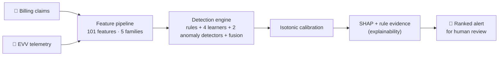
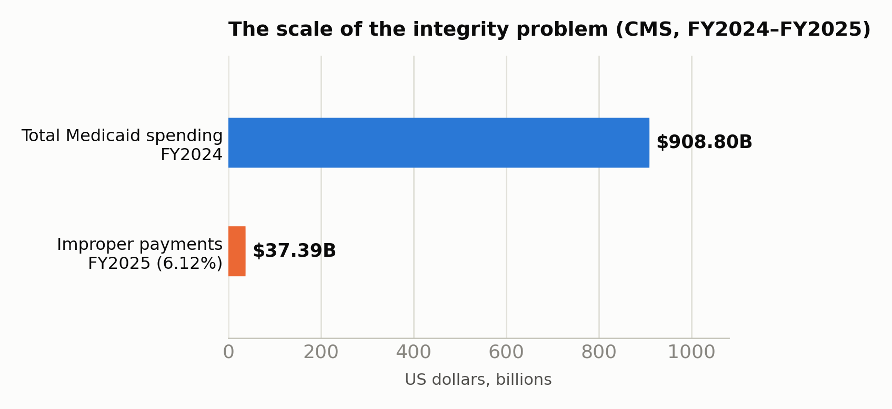
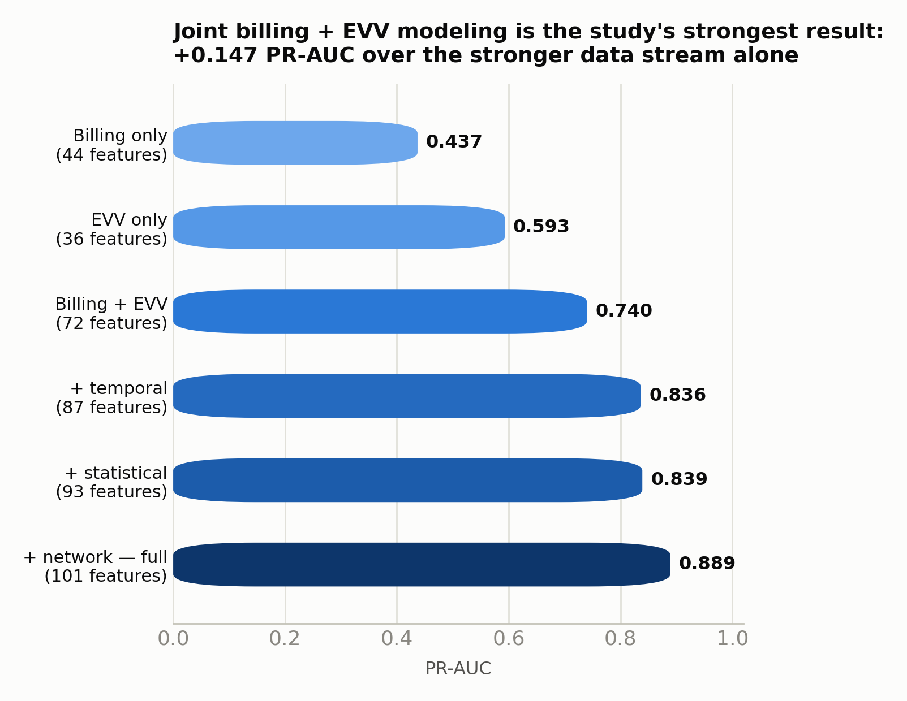
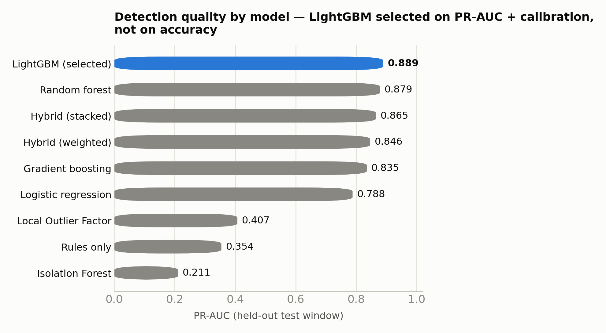
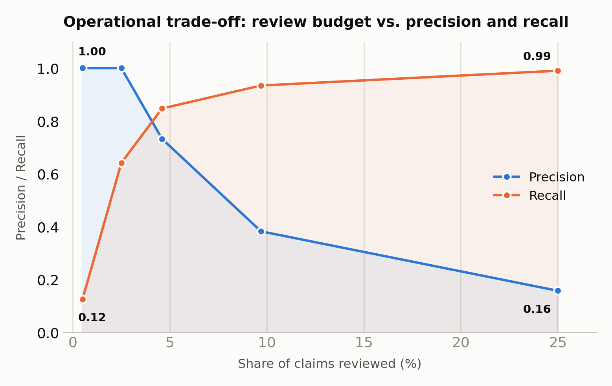

# Safeguarding Public Healthcare Spending with Explainable AI: A Statistically Validated Machine Learning Framework for Medicaid Fraud Detection and Electronic Visit Verification


[](LICENSE)
[]()
[]()
[-blueviolet.svg)](https://doi.org/10.32996/jcsts.2026.5.3.4)

**[→ Open the interactive results dashboard](https://sibbirhossain.github.io/medicaidguard-xai/)** — every chart on this page, hoverable, in one scroll.

> Alerts are review recommendations, not findings of fraud. Every metric below is produced on **synthetic data with simulated labels** — stated once here, and never quietly dropped further down.

---

## What this is, in one picture

A home care visit has no institutional witness — only a billing claim and an EVV check-in/check-out record, almost never modeled together because no public dataset links them with verified fraud outcomes. This project builds that missing joint model, validates it statistically, explains every alert it produces, and packages the whole thing to be run and checked by someone other than its author.





Medicaid improper payments hit **$37.39B (6.12%)** in FY2025 against **$908.8B** in total FY2024 spending (CMS). Congress created a second, independent data source to help — EVV, mandated by the 21st Century Cures Act §12006(a) — but joint billing+EVV modeling is essentially absent from the published literature, because the linked data has never been public.

<details>
<summary><b>Full source citations for the stats above</b></summary>

CMS, *FY2025 Improper Payments Fact Sheet* (Medicaid: 6.12%, $37.39B); CMS PERM Medicaid state improper payment rates, 2025; Medicaid FY2024 spending (~$908.8B), CMS National Health Expenditure data; 21st Century Cures Act §12006(a) (PCS deadline Jan 2020, HHCS deadline Jan 2023, FMAP penalty up to 1%); U.S. Bureau of Labor Statistics, Occupational Outlook Handbook, *Home Health and Personal Care Aides* (4,677,100 employed 2025; +18% / 847,300 new jobs by 2035 — the largest single US occupation). All figures are external, independently verifiable, publicly reported statistics — none is an output of this project's model or impact simulator.
</details>

---

## Research foundation

This sits on two connected pieces of research by the same author — they report **different numbers** because they answer related but distinct questions on different data:

| | 📄 Peer-reviewed paper | 💻 This repository |
|---|---|---|
| Venue | *Frontiers in Computer Science and AI*, 5(3), 35–44 (2026) · [DOI](https://doi.org/10.32996/jcsts.2026.5.3.4) | Open-source, MIT licensed |
| Scale | 5,410 providers · 500,000+ claims | 45,297 claims · 43,106 EVV events (synthetic) |
| Features | 17-dimensional | 101 across 5 families |
| Best model | Random Forest | LightGBM (selected for speed + calibration) |
| Headline metric | F1 = 0.649 · ROC-AUC = 0.950 | PR-AUC = 0.889 · ROC-AUC = 0.985 |
| Focus | Billing-based fraud detection | Billing **+ EVV** joint modeling, full statistical validation, production engineering |

This repo is the full open-source engineering extension of that research program — adding the EVV integration, expanding the feature space 6×, and replacing a single best-model comparison with a nine-model statistically validated benchmark plus a production API, dashboard, Docker image, and CI suite.

---

## Results, visually



**Joining billing and EVV is the study's strongest result** — +0.147 PR-AUC over the stronger data stream alone. That is the substantive, quantified case for why the Cures Act's EVV mandate is worth modeling jointly with billing.



LightGBM is selected on **PR-AUC + a calibration floor, not on accuracy** — at 3.97% prevalence a do-nothing classifier scores 0.960 accuracy while catching nothing. LightGBM is **not** statistically distinguishable from random forest (ΔPR-AUC CI crosses zero); its real advantage is training in **5.6s vs 57.9s / 79.3s** for random forest / gradient boosting, at equivalent detection quality.



At a 2.5% review budget, this benchmark sustains **1.000 precision at 0.641 recall** — the kind of ranking-quality evidence a program would evaluate before piloting a real deployment.

### Every hypothesis, reported honestly

| # | Hypothesis | Result |
|---|---|---|
| H1 | Learned models beat transparent rules |  PR-AUC 0.889 vs 0.354, CI [0.481, 0.585] |
| H2 | Billing + EVV beats either family alone |  0.437 / 0.593 → 0.740 combined |
| H3 | Hybrid fusion beats the best single model |  Best hybrid 0.865 vs LightGBM 0.889 |
| H4 | Scores calibrate to usable probabilities |  Brier 0.0088, ECE 0.0028 |
| H5 | Performance holds on held-out scenarios |  0.42–0.90 recall@5% vs ~1.00 trained |

H3 is a negative result on the project's own headline claim, reported rather than tuned away — the honest reporting is treated as part of the contribution, not a caveat around it.

<details>
<summary><b>Full results tables</b> — model comparison (all 8 metrics), significance tests, scenario generalization, class imbalance, operational capacity, efficiency breakdown</summary>

**Model comparison — held-out test window** (45,297 synthetic claims, 101 features, seed 20260913, 7,233-claim test window at 3.97% prevalence)

| Model | PR-AUC | ROC-AUC | P@5% | R@5% | Accuracy | Trivial baseline | Brier | ECE |
|---|---|---|---|---|---|---|---|---|
| **LightGBM** *(selected)* | **0.889** | 0.985 | 0.674 | 0.850 | 0.988 | 0.960 | 0.0088 | 0.0028 |
| Random forest | 0.879 | 0.988 | 0.671 | 0.847 | 0.987 | 0.960 | 0.0103 | 0.0018 |
| Hybrid (stacked) | 0.865 | 0.983 | 0.669 | 0.843 | 0.989 | 0.960 | 0.0088 | 0.0032 |
| Hybrid (weighted) | 0.846 | 0.978 | 0.657 | 0.829 | 0.990 | 0.960 | 0.0090 | 0.0015 |
| Gradient boosting | 0.835 | 0.987 | 0.682 | 0.861 | 0.985 | 0.960 | 0.0112 | 0.0022 |
| Logistic regression | 0.788 | 0.974 | 0.624 | 0.787 | 0.983 | 0.960 | 0.0137 | 0.0031 |
| Local Outlier Factor | 0.407 | 0.757 | 0.373 | 0.470 | 0.965 | 0.960 | — | — |
| Rules only | 0.354 | 0.843 | 0.354 | 0.446 | 0.938 | 0.960 | 0.0290 | 0.0014 |
| Isolation Forest | 0.211 | 0.823 | 0.246 | 0.310 | 0.933 | 0.960 | — | — |

Selected model PR-AUC with caregiver-clustered bootstrap CI: **0.889 [0.860, 0.917]** (300 resamples). ROC-AUC: 0.985 [0.977, 0.992] (500 resamples).

**Significance vs LightGBM**

| Comparison | ΔPR-AUC | 95% CI | DeLong *p* (ROC) |
|---|---|---|---|
| vs rules only | +0.535 | [0.481, 0.585] | <0.001 |
| vs Isolation Forest | +0.679 | [0.622, 0.719] | <0.001 |
| vs Local Outlier Factor | +0.482 | [0.417, 0.541] | <0.001 |
| vs logistic regression | +0.101 | [0.069, 0.139] | 0.044 |
| vs hybrid (weighted) | +0.043 | [0.028, 0.060] | 0.043 |
| vs hybrid (stacked) | +0.024 | [0.013, 0.037] | 0.230 |
| vs gradient boosting | +0.054 | [0.028, 0.085] | 0.460 |
| **vs random forest** | **+0.010** | **[−0.002, 0.021]** | **0.242** |

**Feature ablation**

| Feature set | Features | PR-AUC | ROC-AUC | P@5% | R@5% |
|---|---|---|---|---|---|
| Billing only | 44 | 0.437 | 0.788 | 0.354 | 0.446 |
| EVV only | 36 | 0.593 | 0.838 | 0.492 | 0.620 |
| Billing + EVV | 72 | 0.740 | 0.935 | 0.583 | 0.735 |
| + temporal | 87 | 0.836 | 0.976 | 0.638 | 0.805 |
| + statistical | 93 | 0.839 | 0.976 | 0.638 | 0.805 |
| + network (full) | 101 | **0.889** | 0.985 | 0.674 | 0.850 |

**Scenario generalization** — three scenarios relabeled negative during training

| Scenario | Held out | Recall@5% |
|---|---|---|
| Excessive workload, authorization exceedance, billing spike, duplicate claim, EVV duration mismatch, provider concentration, weekend, after-hours | No | 1.000 |
| Implausible travel | No | 0.905 |
| Suspicious timestamps | **Yes** | 0.900 |
| Provider billing shift | No | 0.889 |
| Coordinated activity | **Yes** | 0.769 |
| Authorization inconsistency | No | 0.722 |
| Overlapping visits | No | 0.500 |
| Near-duplicate claim | **Yes** | 0.417 |
| Missing EVV | No | 0.188 |

Missing EVV at 0.188 is the operationally important number: the model correctly learned not to over-weight a signal that tracks connectivity and device access more than misconduct.

**Class imbalance**

| Injected prevalence | Observed | PR-AUC | P@5% | R@5% | Brier |
|---|---|---|---|---|---|
| 1.0% | 0.0115 | 0.843 | 0.206 | 0.892 | 0.0027 |
| 2.0% | 0.0212 | 0.889 | 0.388 | 0.915 | 0.0039 |
| 3.5% | 0.0397 | 0.889 | 0.674 | 0.850 | 0.0088 |
| 6.0% | 0.0674 | 0.918 | 0.995 | 0.737 | 0.0133 |

**Operational capacity**

| Reviewed | Precision | Recall | Alerts / 100k claims | Investigator FTE |
|---|---|---|---|---|
| 0.5% | 1.000 | 0.125 | 500 | 0.44 |
| 2.5% | 1.000 | 0.641 | 2,542 | 2.24 |
| 4.6% | 0.732 | 0.847 | 4,583 | 4.04 |
| 9.7% | 0.382 | 0.934 | 9,688 | 8.55 |
| 25.0% | 0.157 | 0.990 | 25,000 | 22.06 |

FTE figures assume 1.5 review hours/alert and 1,700 productive hours/year — stated assumptions, not measurements.

**Computational efficiency** — single CPU core, 45,297 claims × 101 features

| Stage | Seconds |
|---|---|
| Feature engineering (all 45k rows) | 3.62 |
| Rule screening | 0.01 |
| LightGBM training | 5.61 |
| Random forest training | 57.89 |
| Gradient boosting training | 79.34 |
| Isolation Forest fit | 1.51 |
| LightGBM inference (7,233 claims) | 0.86 |

**Fairness diagnostics** — across synthetic cohorts, PR-AUC ranges 0.865–0.932 and FPR ranges 0.031–0.047. These numbers describe the measurement pipeline, not any real population — cohort labels are randomly assigned by the generator.

</details>

---

## Engineering rigor

Four ways fraud-detection results usually fail, each addressed and tested:

1. **Label leakage** — column blocklist, entity IDs excluded, strictly backward-looking temporal aggregates, train-window-only fitting (`test_peer_statistics_are_fitted_on_train_only`). Diagnostic guard for any feature at AUC ≥ 0.999: none flagged.
2. **Random splits on time-ordered data** — strict chronological train/validate/test split with caregiver-clustered bootstrapping.
3. **Uncalibrated scores presented as probabilities** — isotonic calibration fit on validation, applied identically to every model including the rule baseline.
4. **Accuracy reported without its trivial baseline** — every table states the constant-classifier baseline beside the model's own accuracy.

Every alert carries SHAP local attributions, structured rule evidence in plain sentences, and this boundary, verbatim: *"Feature attributions describe how this model reached its score. They are not evidence of intent, causation, or wrongdoing, and they do not constitute a finding of fraud."* No API endpoint changes a claim's status, denies a service, or alters an authorization.

<details>
<summary><b>What the test suite has actually caught</b></summary>

An independently-drawn EVV check-out offset was inverting 36% of visit intervals on short visits, and an empty EVV table crashed feature construction through a dtype path. Both were found by tests before any result was reported, fixed, and every result regenerated — recorded here because a test suite that has never caught anything is not evidence of quality.
</details>

---

## Implementable, not just a paper

```bash
git clone https://github.com/sibbirhossain/medicaidguard-xai.git
cd medicaidguard-xai
python -m venv .venv && source .venv/bin/activate
pip install -r requirements.txt && pip install -e .

make data         # generate the synthetic dataset
make train        # train, compare, select, calibrate
make experiments  # full experiment suite -> reports/tables/
make test         # 43 tests
```

Or `make all` end to end (~20 minutes, single CPU core). `make dashboard` → `localhost:8501`; `make api` → `localhost:8000/docs`; `docker compose up --build` runs the full stack; [`notebooks/MedicaidGuard_XAI_Colab.ipynb`](notebooks/MedicaidGuard_XAI_Colab.ipynb) reproduces everything on Colab's free tier with zero local setup.

**Path to real-world use:** swap the synthetic generator for a state agency's or aggregator's real, linked claims-and-EVV extract under a data-use agreement, re-run `make all`, and every chart above regenerates against real data on the same leakage-tested pipeline — nothing about the architecture is synthetic-data-specific, only the input is.

<details>
<summary><b>API reference</b></summary>

```bash
curl -X POST localhost:8000/predict -H 'Content-Type: application/json' -d '{
  "claim_id":"TEST001","provider_id":"PRV0001","caregiver_id":"CG00001",
  "patient_id":"PT000001","service_date":"2024-11-15",
  "billing_start_time":"2024-11-15T09:00:00","billing_end_time":"2024-11-15T17:00:00",
  "billed_hours":8.0,"authorized_hours":4.0,"service_code":"T1019",
  "billed_amount":220.0,"submission_timestamp":"2024-11-15T17:01:00"}'
```

Endpoints: `/health` `/metrics` `/alerts` `/alerts/{id}` `/providers/{id}` `/caregivers/{id}` `/evv/{id}` `/predict` `/batch-predict` `/model-info` `/explanations/{id}` `/experiments` `/data-quality` `/scenario-simulation`.
</details>

---

## Potential impact

| ✅ Established by this work | ⬜ Not yet shown, by design |
|---|---|
| First open, reproducible methodology for joint billing + EVV modeling — a gap essentially absent from published fraud-detection literature | Real-world detection performance — every result above is on synthetic data with simulated labels |
| Quantified evidence (+0.147 PR-AUC) that the two data streams the EVV mandate makes possible are worth modeling jointly | Any measured dollar savings — the impact simulator's outputs are labeled illustrative on every field |
| A leakage-safe, statistically validated evaluation harness that resists the field's four most common failure modes | Pilot deployment or external validation — none has occurred |
| An equity property, validated directly: access-correlated signals (missing EVV) are deliberately down-weighted | Cross-dataset validation — no compatible real dataset pair exists (see [`reports/dataset_discovery.md`](reports/dataset_discovery.md)) |
| A fully reproducible, MIT-licensed pipeline any state agency, vendor, or researcher can run, audit, or extend | |

A figure suggesting otherwise would be worse than reporting the gap honestly, which is why none is offered here. The methodology generalizes beyond Medicaid — the same architecture applies to any public benefit program with a similar verification-versus-claim structure: Medicare home health, SNAP, unemployment insurance, disability benefits.

---

## Data

No public dataset links Medicaid personal-care claims to EVV telemetry with verified fraud labels. [`reports/dataset_discovery.md`](reports/dataset_discovery.md) documents the full search (CMS Data, Data.Medicaid.gov, Data.gov, HHS OIG, state portals, Kaggle, UCI, PhysioNet, Harvard Dataverse, Zenodo, Figshare) and why the two closest public candidates were evaluated and rejected as primary sources.

| Track | Status |
|---|---|
| A — Real public data | Ingestion framework built. Informs feature design and background framing only; no public row contributes to a reported result. |
| B — Synthetic Medicaid + EVV | **Primary.** 16 configurable scenarios, reproducible seeds. |
| C — Cross-dataset validation | Not performed — no compatible dataset pair exists. |

---

## Limitations

Read before citing anything above.

1. **Synthetic labels** — results measure recovery of injected behavioral patterns, not real-world fraud detection.
2. **Shared authorship of generator and detector** — scenarios are partly detectable because they were designed in representable form.
3. **H3 unsupported** — hybrid fusion did not beat the best single model.
4. **Selected model not statistically distinguishable from random forest** — efficiency, not accuracy, is the deployment argument.
5. **Single simulated year** — multi-year drift untested.
6. **Cross-dataset validation not performed.**
7. **Fairness results describe synthetic cohorts only.**
8. **Impact-simulator outputs are arithmetic on stated assumptions**, never measured savings.
9. **Ablation uses a restricted learner set** for runtime (`configs/experiments.yaml`).

Full detail: [`reports/limitations.md`](reports/limitations.md), [`docs/methodology.md`](docs/methodology.md).

---

## About the research program

The author works in billing and technology administration at a New York home care agency, covering Medicaid billing automation, EVV compliance tracking, multi-payer authorization workflows, and HHAeXchange platform management — domain grounding visible in specific design choices, from the 16 injected scenarios to the deliberately low missing-EVV rule weight.

M.S. Computer Science, CUNY City College of New York · B.S. Computer Science & Engineering, American International University-Bangladesh · [ORCID 0009-0002-0795-4512](https://orcid.org/0009-0002-0795-4512) · [Google Scholar](https://scholar.google.com/citations?user=MMJRxLEAAAAJ) · peer reviewer and editorial board member.

<details>
<summary><b>Citation (BibTeX)</b></summary>

```bibtex
@article{hossain2026safeguarding,
  author  = {Hossain, Md Sibbir and Hasan, A T M Fokrule},
  title   = {Safeguarding Public Healthcare Spending with Explainable AI:
             A Statistically Validated Machine Learning Framework for
             Medicaid Fraud Detection and Electronic Visit Verification},
  journal = {Frontiers in Computer Science and Artificial Intelligence},
  volume  = {5}, number = {3}, pages = {35--44}, year = {2026},
  doi     = {10.32996/jcsts.2026.5.3.4}
}

@software{hossain_medicaidguard_xai_2026,
  author  = {Hossain, Md Sibbir},
  title   = {MedicaidGuard-XAI: An Explainable, Statistically Validated Framework
             for Prioritizing Suspicious Medicaid Billing and EVV Activity},
  year    = {2026},
  url     = {https://github.com/sibbirhossain/medicaidguard-xai},
  license = {MIT}
}
```
See [`CITATION.cff`](CITATION.cff).
</details>

---

## Documentation

| Document | Contents |
|---|---|
| [`reports/dataset_discovery.md`](reports/dataset_discovery.md) | Full public-dataset search, evaluation, and selection rationale |
| [`reports/research_report.md`](reports/research_report.md) | Full research report built from the actual results |
| [`reports/limitations.md`](reports/limitations.md) | Consolidated limitations |
| [`docs/methodology.md`](docs/methodology.md) | Problem formulation, splitting, leakage control, statistics |
| [`docs/architecture.md`](docs/architecture.md) | Pipeline diagrams and module map |
| [`docs/data_dictionary.md`](docs/data_dictionary.md) | Every table and field |
| [`docs/privacy.md`](docs/privacy.md) | Privacy threat model, responsible AI, bias analysis, misuse |
| [`docs/reproducibility.md`](docs/reproducibility.md) | Seeds, pinning, nondeterminism, verification |
| [`docs/deployment.md`](docs/deployment.md) | Local, Docker, and production considerations |
| [`SECURITY.md`](SECURITY.md) | Threat model and disclosure |

## License

MIT — see [`LICENSE`](LICENSE).
