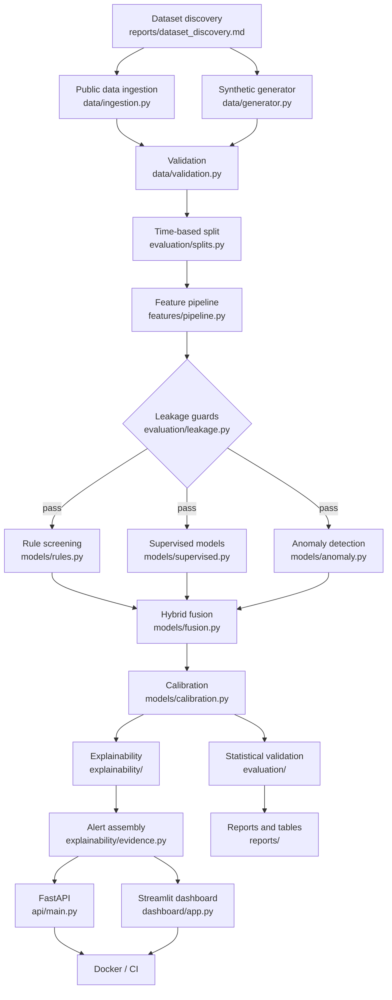
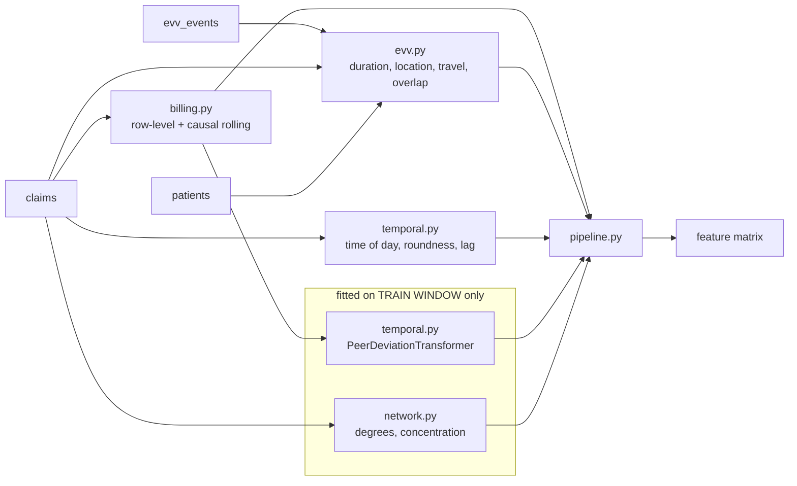

# Architecture

## Pipeline

## Feature construction

## Module map

| Path | Responsibility |
|---|---|
| `config.py` | Paths, seeds, generator/split/selection configuration, YAML loading |
| `data/schema.py` | Table contracts, keys, and the leakage-column blocklist |
| `data/generator.py` | Synthetic Medicaid + EVV generation, 16 scenarios |
| `data/validation.py` | Schema, referential integrity, plausibility, missingness |
| `data/ingestion.py` | Public-dataset ingestion with licences and checksums |
| `data/metadata.py` | Run provenance: git commit, package versions, platform |
| `features/*` | Five feature families plus the fit/transform pipeline |
| `models/rules.py` | Transparent rule engine and structured evidence |
| `models/supervised.py` | Candidate learner zoo |
| `models/anomaly.py` | Isolation Forest, LOF |
| `models/fusion.py` | Two fusion strategies, priority bands, selection rule |
| `models/calibration.py` | Isotonic / Platt calibration |
| `evaluation/metrics.py` | PR-AUC, Precision@K, calibration error, workload |
| `evaluation/confidence_intervals.py` | Bootstrap, cluster bootstrap, DeLong, McNemar |
| `evaluation/leakage.py` | Runtime leakage assertions |
| `evaluation/experiments.py` | `run_pipeline` plus the experiment suite |
| `explainability/*` | SHAP wrapper, alert assembly and narratives |
| `impact/simulator.py` | Scenario-based workload and illustrative economics |
| `api/*` | FastAPI service |
| `database/*` | SQLAlchemy schema, session, repository |

## Design decisions worth defending

**One `run_pipeline` function, used everywhere.** The scripts, the notebooks and
the tests all call it. This is why the numbers in the report, the dashboard and
the API cannot drift apart — there is no second code path that could disagree.

**Rules retained despite weak standalone performance.** Rule PR-AUC is roughly a
third of the best model's. They stay because rule evidence is what a reviewer
can restate as a factual assertion about the claim, and what survives an appeal.

**Fusion strategies compared, not assumed.** Averaging component scores with
arbitrary weights is the common shortcut. Both a transparent weighted scheme and
a learned stacked scheme are implemented and evaluated, and the selected one is
recorded.

**Unsupervised track kept despite low labelled scores.** It is the only
component that can respond to a scheme with no training labels, which is the
realistic case for novel fraud.
